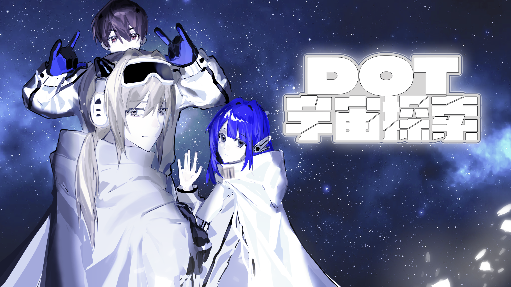

# DOT 宇宙探索 | 宇宙是一场生命游戏

## 游戏简介

《DOT 宇宙探索》是一款2D叙事解谜冒险游戏，讲述在一个由康威生命游戏模型模拟的宇宙中，失忆的主角 `Neumann` 与只存在于点阵世界的少女 `Damsel` 一同探索古文明遗迹，寻找宇宙真相和自身记忆的故事。

游戏融合了哲学思辨、科学探索和情感叙事，通过独特的"点阵视域"机制，让玩家体验现实与本质之间的转换，探讨生命、文明和宇宙的终极意义。

## 游戏特色

### 核心机制

- **点阵视域系统**：按Q键切换视角，看到世界的点阵构造，发现隐藏信息和密码
- **点阵化能力**：按E键暂时将自己转化为点阵状态，与点阵世界交互，但会消耗Point值
- **密码锁解谜**：游戏中大量密码锁需要通过点阵视域发现密码，是推进剧情的关键
- **宇宙漏洞机制**：蓝黑色漏洞会伤害玩家，需要避开或使用特殊能力修复
- **资源管理**：Point值用于解谜和维持点阵化状态，HP值代表生命值

### 叙事特点

- **多分支剧情**：玩家选择影响故事走向和结局
- **丰富角色**：宇宙维护员、考古学家、隐士等NPC各具特色
- **哲学主题**：探讨生命本质、文明存续和宇宙构造
- **情感共鸣**：Neumann 与 Damsel 的羁绊贯穿始终

## 游戏世界

### 背景设定

在一个由康威生命游戏模型模拟的宇宙中，古文明已经灭绝，宇宙处于冷却状态，到处是漏洞。主角 Neumann 失去记忆，驾驶着小行星 F-646 在宇宙中旅行，寻找自己的过去和宇宙的真相。

在探索过程中，他遇到了只存在于点阵世界的少女 Damsel，两人结伴同行，踏上了一段揭示宇宙本质的旅程。

### 主要角色

- **Neumann**：主角，失忆的旅行者，能够看到并进入点阵世界
- **Damsel**：只存在于点阵世界的少女，以蓝色玫瑰投影出现在现实世界
- **宇宙维护员**：宇宙中唯一的维护工人，修补宇宙漏洞
- **考古学家**：研究古文明的学者，对古文明灭绝有独到见解
- **隐士**：知晓古文明秘密的老人，喜欢下棋和哲学思辨

## 游戏流程

### 第一章节：相遇与启程

玩家进入废墟，学习使用点阵视域和点阵化能力，遇到 Damsel 并结伴同行。通过解谜获得关于古文明研究的报告，了解宇宙的基本设定。

### 第二章节：宇宙漏洞

引入宇宙漏洞机制，遇到宇宙维护员，了解宇宙的现状和维护工作。玩家可以选择开启宇宙维护员支线，获得修复漏洞的能力。

### 第三章节：古文明的秘密

探索太空试验舱，遇到考古学家和隐士，通过解谜获得关于古文明和宇宙构造的更多信息。玩家可以选择开启 Damsel 支线，影响最终结局。

### 第四章节：真相与抉择

进入宇宙中控室，通过一系列复杂解谜，揭示宇宙的真相——这是一个被暂停的康威生命游戏模型。玩家面临重启宇宙或延续现状的抉择。

### 第五章节：结局

根据玩家之前的 choices，进入不同的结局路线：

- **重启线**：将宇宙重启，一切归零重来
- **延续线（普通）**：与Damsel继续旅行，寻找其他幸存者
- **延续线（新生）**：Damsel获得实体，两人在花园重逢

## 游戏系统

### 资源系统

- **Point值**：用于解谜和维持点阵化状态，初始15点
- **HP值**：生命值，初始3点，触碰漏洞或长时间维持点阵化会消耗

### 交互系统

- 场景中可交互对象会显示提示符号
- 角色对话支持多行显示和自动换行
- 密码锁系统支持多种密码类型和验证方式

### 存档系统

- 自动保存关键进度和选择
- 支持手动存档和读档
- 保存收集品和对话记录

## 技术实现

### 开发环境

- 团结引擎（2021.3或更高版本）
- C#脚本语言
- TextMeshPro文本系统
- 2D渲染和物理系统

### 核心脚本

- **SimpleStateManager**：全局状态管理，处理存档读档
- **DialogueManager**：对话系统，支持多角色、多表情对话
- **SceneLoader**：场景加载管理，支持异步加载和场景切换
- **PasswordLockManager**：密码锁系统，支持多种密码类型
- **GameUI**：UI管理，显示HP和Point值

### 场景结构

- **CoreScene**：核心场景，包含全局管理器和UI
- **Home**：主界面场景，包含小行星F-646和功能菜单
- **第一幕**：初始废墟和教学场景
- **002-030**：主要探索场景，包含各种谜题和剧情
- **031-032**：中控室场景，最终解谜区域
- **Finals**：结局场景，包含多种结局演出

## 操作说明

### 基本操作

- **方向键/WASD**：角色移动
- **鼠标左键**：确认/交互
- **ESC**：取消/跳过对话
- **Q键**：切换点阵视域
- **E键**：进入/退出点阵化状态

### 界面操作

- **主界面**：点击 Start 按钮进入游戏，点击 Exit 按钮退出游戏
- **对话界面**：鼠标左键继续对话，ESC跳过对话
- **密码锁界面**：点击数字输入密码，确认键提交

## 开发团队

本项目为 GameJam 2026 项目，由团队 **（什么叫队里除了温柔学姐就是白毛红瞳小萝莉）** 完成：

- **热尘**：程序、项目负责人、游戏测试
- **缈**：游戏策划、剧情设计、文案
- **一颗芽菜**：美术设计、场景、人物
- **绿豆冰**：美术设计、场景、人物、音乐
- **GEORGEWU**：程序、UI/UX设计、游戏测试

## 版权说明

本项目为原创 GameJam 2026 作品，版权所有 © 2026 队里除了温柔学姐就是白毛红瞳小萝莉。

## 免责声明

本游戏为 GameJam 2026 参赛作品，不代表任何商业实体。
游戏中使用的所有名称、商标、服务标记等均为其各自所有者的财产。
本游戏不包含任何形式的广告、推广或销售内容，仅供学习和交流使用，不涉及任何商业用途！

## 相关链接

如有问题或建议，请通过以下方式联系：

- 游戏官网：[https://georgewwwu.github.io/dotexplore/](https://georgewwwu.github.io/dotexplore/)
- 项目仓库：[https://github.com/GEORGEWWWU/dotexplore](https://github.com/GEORGEWWWU/dotexplore)
- 开发者邮箱：[dormcraft@outlook.com](mailto:dormcraft@outlook.com)

GameJam 2026 官网：[https://gmhub.com/jams/ugoa2026](https://gmhub.com/jams/ugoa2026)

---

*"宇宙是什么？——宇宙是一场游戏，一场生命的游戏。"*
